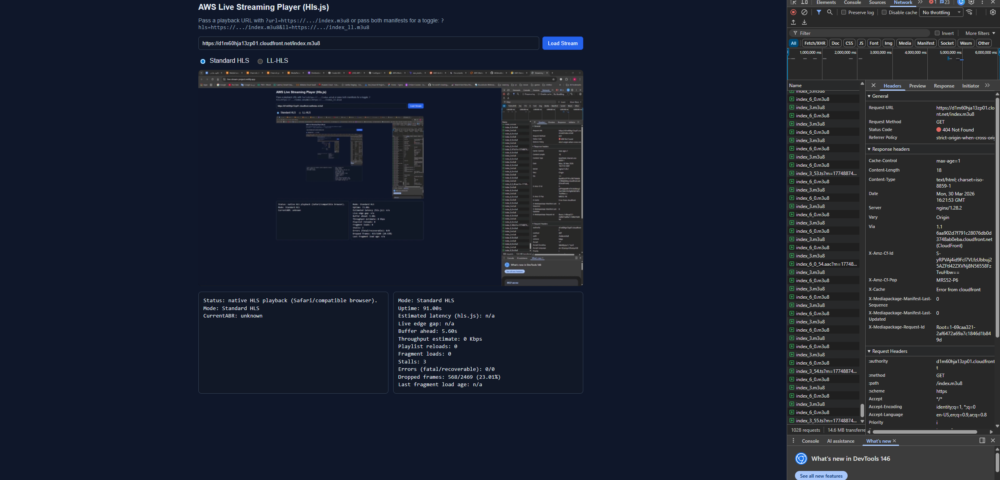

# AWS Live Streaming Pipeline

This project provisions two end-to-end AWS live streaming pipelines using **Infrastructure as Code (Terraform)** and compares standard HLS against Low-Latency HLS (LL-HLS).



## What It Does

| Stage | Service | Detail |
|-------|---------|--------|
| **Ingest** | AWS MediaConnect | SRT listener (port 5000, configurable) |
| **Transcode** | AWS MediaLive | H.264 CBR, 1080p, 30 fps, 2-second GOP |
| **Package** | AWS MediaPackage | v1 (HLS) or v2 (HLS + LL-HLS via CMAF) |
| **Distribute** | Amazon CloudFront | Short-TTL manifest caching, CORS headers |
| **Play** | Web Player | Hls.js (standard HLS) + Shaka Player (LL-HLS) |

---

## Architecture


---

## Project Structure

```
terraform-hls/            # Standard HLS pipeline (MediaPackage v1)
  main.tf                 # IAM, MediaConnect, MediaLive, MediaPackage v1, CloudFront
  variables.tf            # Input variables and validation rules
  outputs.tf              # SRT ingest URL, CloudFront playback URL, etc.
  terraform.tfvars        # Environment-specific overrides

terraform-ll-hls/         # LL-HLS pipeline (MediaPackage v2)
  main.tf                 # IAM, MediaConnect, MediaPackage v2 (CMAF), MediaLive (CMAF Ingest), CloudFront
  variables.tf            # Input variables and validation rules
  outputs.tf              # SRT ingest URL, HLS + LL-HLS CloudFront playback URLs
  terraform.tfvars        # Environment-specific overrides

web-player/
  index.html              # Dual-engine player: Hls.js (HLS) + Shaka Player (LL-HLS), analytics panel

assets/                   # Architecture diagrams and screenshots
```

---

## Region Choice

Both stacks use **`eu-west-2` (London)** with AZ **`eu-west-2a`**.

**Why London instead of UAE (`me-central-1`)?**

- The `terraform-hls` stack uses MediaPackage **v1**, which is not available in UAE.
- Both protocols must be in the same region for a fair latency comparison.
- UAE supports MediaPackage **v2** (LL-HLS + HLS), so `terraform-ll-hls` could run there standalone. Once the v1 stack is no longer needed for comparison, UAE would be the preferred region for proximity to Saudi Arabia.

---

## Prerequisites

- **OS**: Windows 11 / macOS / Linux (any OS that runs Terraform CLI)
- **Terraform**: 1.5+
- **AWS account** with permissions for: MediaConnect, MediaLive, MediaPackage, IAM, CloudFront, CloudFormation
- **AWS credentials** configured (`aws configure`, SSO, or environment variables)
- **OBS Studio** (or `ffmpeg`) for SRT ingest

> The Terraform code and the web player are fully OS-agnostic. The only OS-specific step is how you push SRT from your encoder (OBS or ffmpeg).

### AWS Credentials for Terraform

Terraform uses the standard AWS credential chain. If `terraform plan` fails with **No valid credential sources found**:

1. Verify credentials: `aws sts get-caller-identity`. If that fails, run `aws configure`.
2. If you use a **named profile**, set it before running Terraform:

```powershell
# PowerShell
$env:AWS_PROFILE = "your-profile-name"
terraform plan
```

```bash
# bash / zsh
export AWS_PROFILE="your-profile-name"
terraform plan
```

Or set `aws_profile = "your-profile-name"` in `terraform.tfvars`.

3. The message about **EC2 IMDS** is normal on a laptop — Terraform tries instance metadata last and times out. It does not mean you must use EC2.

---

## Deploy

Both stacks pin the **HashiCorp AWS provider** to `~> 6.38`.

### Standard HLS stack

```bash
cd terraform-hls
terraform init -upgrade
terraform apply -var-file="terraform.tfvars"
```

### LL-HLS stack

```bash
cd terraform-ll-hls
terraform init -upgrade
terraform apply -var-file="terraform.tfvars"
```

> `init -upgrade` refreshes `.terraform.lock.hcl` and downloads the matching provider binary.

---

## Start the Flow and Channel

`terraform apply` provisions all resources but leaves MediaConnect and MediaLive in a **stopped state**. You must start them manually.

> **Billing warning**: MediaLive charges while the channel is running. MediaConnect and CloudFront also incur costs. Stop the channel and flow when testing is done to avoid unnecessary charges.

### 1. Start MediaConnect Flow

**PowerShell (Windows):**

```powershell
$region = "eu-west-2"
$flowArn = terraform output -raw mediaconnect_flow_arn
aws mediaconnect start-flow --region $region --flow-arn $flowArn
```

**bash / zsh (macOS / Linux):**

```bash
region="eu-west-2"
flowArn="$(terraform output -raw mediaconnect_flow_arn)"
aws mediaconnect start-flow --region "$region" --flow-arn "$flowArn"
```

### 2. Start MediaLive Channel

**PowerShell (Windows):**

```powershell
$region = "eu-west-2"
$channelName = "streaming-project-flow-channel"  # or "streaming-project-flow-llhls-channel"
$channelId = aws medialive list-channels --region $region --max-results 100 `
  --query "Channels[?Name=='$channelName'].Id | [0]" --output text
aws medialive start-channel --region $region --channel-id $channelId
```

**bash / zsh (macOS / Linux):**

```bash
region="eu-west-2"
channelName="streaming-project-flow-channel"  # or "streaming-project-flow-llhls-channel"
channelId="$(aws medialive list-channels --region "$region" --max-results 100 \
  --query "Channels[?Name=='$channelName'].Id | [0]" --output text)"
aws medialive start-channel --region "$region" --channel-id "$channelId"
```

> You can also start both from the **AWS Console** if you have proper access.

### 3. Stop (when done)

```bash
aws medialive stop-channel --region "$region" --channel-id "$channelId"
aws mediaconnect stop-flow --region "$region" --flow-arn "$flowArn"
```

---

## OBS Studio Setup (SRT Ingest)

1. Get the ingest URL: `terraform output srt_ingest_url`
   Format: `srt://<ingest-ip>:<port>?streamid=<stream-name>`
2. In OBS: **Settings → Stream → Service: Custom → Server: paste the SRT URL**
3. Click **Start Streaming**

If video does not arrive, check:

- `mediaconnect_whitelist_cidr` allows your public IP (default is `0.0.0.0/0`)
- Local/network firewall allows outbound UDP to the ingest port
- MediaConnect flow and MediaLive channel are both started

---

## Web Player

The web player uses two engines:

| Mode | Engine | Why |
|------|--------|-----|
| **Standard HLS** | [Hls.js](https://github.com/video-dev/hls.js/) 1.6.15 | Mature, widely used HLS player |
| **LL-HLS** | [Shaka Player](https://github.com/shaka-project/shaka-player) 4.16.25 | Google's player with robust LL-HLS support |

### Running the Player

The player is a single HTML file. Serve it with any static web server:

- **Recommended**: VS Code's **"Live Server"** extension — right-click `index.html` → "Open with Live Server"
- Any other local web server (`python -m http.server`, `npx serve`, etc.)

> Opening `file://...` directly in the browser may cause CORS issues.

### URL Formats

**Single URL:**

```
index.html?url=https://<cloudfront-domain>/index.m3u8
```

**Both URLs (enables radio toggle):**

```
index.html?hls=https://<cf-domain>/index.m3u8&ll=https://<cf-domain>/indexll.m3u8
```

The player auto-detects LL-HLS URLs (containing `indexll`) and switches to Shaka Player automatically.

### Analytics Panel

The player displays a live analytics panel with:

- **Estimated latency** — glass-to-glass estimate (seconds behind live)
- **Live edge gap** — how far behind the seekable live edge
- **Buffer ahead** — buffered video ahead of the playback position
- **Throughput** — estimated download bandwidth
- **Stalls** — number of buffer underruns
- **Dropped frames** — GPU/decoder dropped frames vs. total frames

---

## Outputs Reference

### `terraform-hls` Outputs

| Output | Purpose |
|--------|---------|
| `srt_ingest_url` | OBS SRT ingest URL (LISTENER mode) |
| `srt_ingest_instructions` | Guidance for CALLER mode |
| `cloudfront_playback_url` | Public CloudFront HLS playback URL |
| `cloudfront_domain_name` | CloudFront distribution domain |
| `mediapackage_hls_origin_url` | Direct MediaPackage v1 endpoint (debugging only) |
| `mediaconnect_flow_arn` | MediaConnect flow ARN |

### `terraform-ll-hls` Outputs

| Output | Purpose |
|--------|---------|
| `srt_ingest_url` | OBS SRT ingest URL (LISTENER mode) |
| `srt_ingest_instructions` | Guidance for CALLER mode |
| `cloudfront_playback_url_hls` | CloudFront standard HLS playback URL |
| `cloudfront_playback_url_ll_hls` | CloudFront LL-HLS playback URL |
| `cloudfront_domain_name` | CloudFront distribution domain |
| `mediapackage_hls_origin_url` | Direct MediaPackage v2 HLS endpoint (debugging only) |
| `mediapackage_ll_hls_origin_url` | Direct MediaPackage v2 LL-HLS endpoint (debugging only) |
| `mediaconnect_flow_arn` | MediaConnect flow ARN |

---

## Key Differences Between the Two Stacks

| Aspect | `terraform-hls` | `terraform-ll-hls` |
|--------|-----------------|---------------------|
| MediaPackage version | v1 | v2 |
| MediaLive output group | MediaPackage (native) | CMAF Ingest (URL-based) |
| Container format | TS or fMP4 | CMAF (fMP4 only) |
| LL-HLS support | No | Yes (`EXT-X-PART`, blocking reload) |
| MediaLive resource | Terraform `aws_medialive_channel` | CloudFormation `AWS::MediaLive::Channel` |
| Manifest tags | Standard HLS | HLS + LL-HLS (`PROGRAM-DATE-TIME`, `PART-HOLD-BACK`, `PRELOAD-HINT`) |

---

## MediaLive Configuration Notes

- Frame rate is **explicitly specified** (`framerate_control = SPECIFIED`) — required for MediaPackage outputs.
- PAR is 1:1 (`par_control = SPECIFIED`).
- GOP size is **2 seconds** to match the 2-second segment duration.
- Set `medialive_output_framerate_numerator` / `denominator` in `terraform.tfvars` to match your OBS output (default: 30/1 = 30 fps).

---

## HLS vs DASH (Quick Comparison)

| Aspect | HLS | DASH |
|--------|-----|------|
| **Manifest** | `.m3u8` playlists | `.mpd` (XML) |
| **Container** | MPEG-TS or fMP4/CMAF | fMP4/CMAF |
| **Device support** | Strong on iOS/Safari, broad web support | Strong on Android, OTT platforms |
| **Low-latency** | LL-HLS (Apple spec, partial segments) | Low-latency DASH (chunked CMAF) |
| **CDN caching** | Manifest updated frequently, segments cached | Similar pattern with MPD updates |
| **Simplicity** | Often simpler for web + mobile audiences | Simpler if you already operate a DASH toolchain |

---

## Notes

- `hls_segment_duration_seconds` is fixed at **2 seconds** per assignment requirements.
- The `terraform-ll-hls` stack applies MediaPackage v2 resource policies via AWS CLI (`local-exec`) rather than CloudFormation, due to CloudFormation JSON serialization issues with policy documents.
- The `hls_version` variable is informational only — neither MediaPackage v1 nor v2 exposes a direct HLS v3/v4 selector in their CloudFormation resources.
